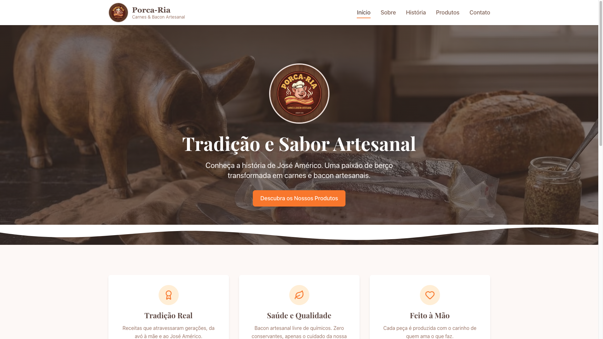
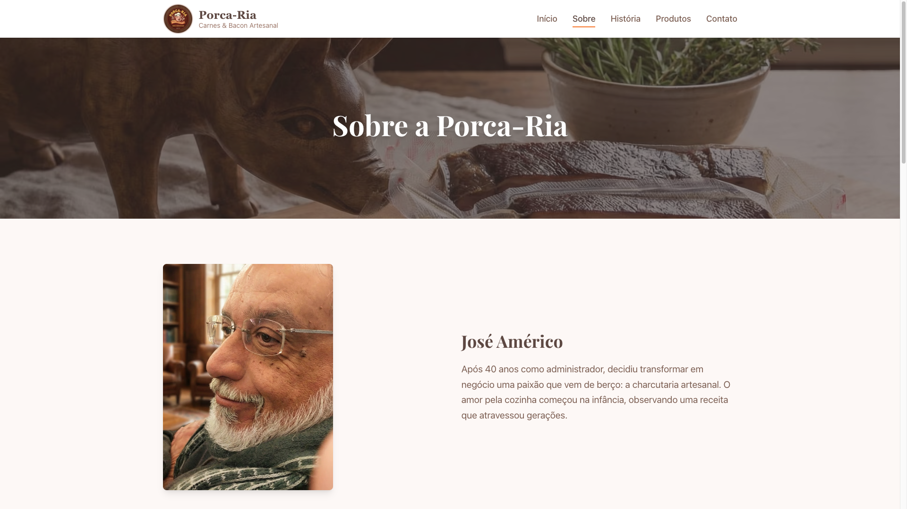
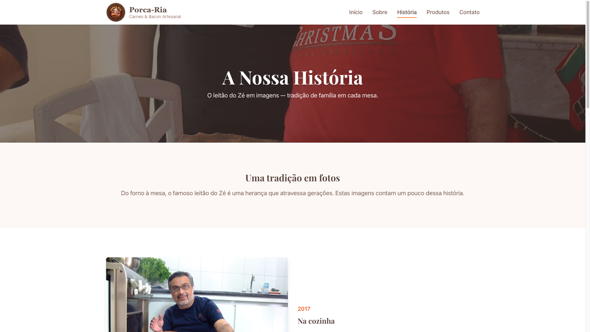
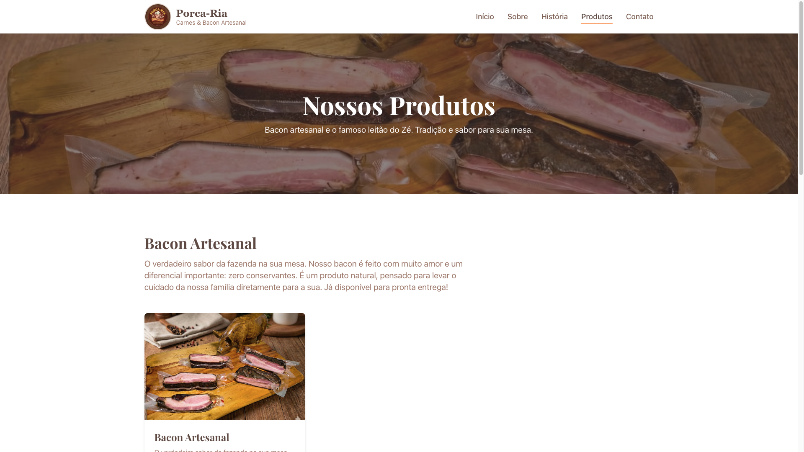
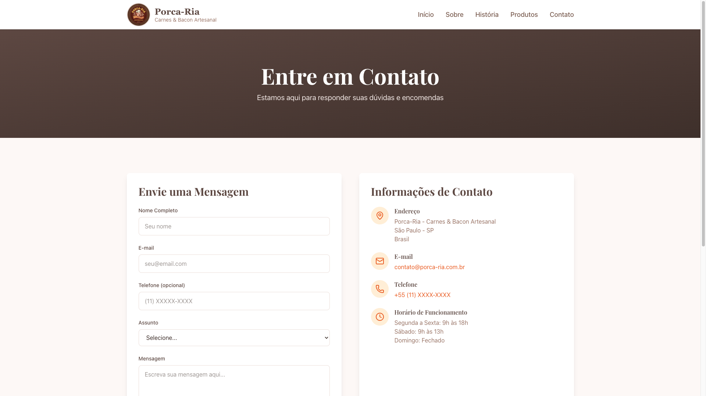

# Porca-Ria

> A little website I built for my dad — and he's quite happy with it.

**Live site:** [porcaria.madpin.dev](https://porcaria.madpin.dev/)



## About this project

This is a small family project. My dad, **José Américo**, spent 40 years working as
an administrator. After retiring, he decided to turn a lifelong passion into a
small business: artisanal charcuterie — handmade bacon and the famous _leitão do Zé_
(whole roasted suckling pig), a recipe that came from his grandmother, was perfected
by his mother, and now lives on in his own kitchen.

I built this website as a gift for him: a place to tell that story, show the
products, and give people a way to get in touch. He loves it, which is the
only review that really matters.

## What's on the site

The website (in Brazilian Portuguese) has five pages:

### Home

The hero, the brand, and a quick intro to what Porca-Ria is about.


### Sobre — About

The story behind the brand and a portrait of my dad, José Américo.



### História — History

A photo timeline of the _leitão do Zé_ across the years — from a 2017 kitchen
shot to recent Christmas tables. This is my favorite page.



### Produtos — Products

The catalog: artisanal bacon (ready to ship) and the famous _leitão do Zé_
(by order, for special occasions).



### Contato — Contact

A contact form plus address, email, phone, and opening hours.



## Repository layout

```
porcaria/
├── README.md              # You are here
├── raw.md                 # Original Portuguese copy used as source for content
├── IMAGE_CATALOG.md       # Catalog of every image in imgs/
├── imgs/                  # Original photos and brand assets (high-res)
├── docs/screenshots/      # Screenshots of the live site (used in this README)
└── porcaria-website/      # The Next.js application
```

The website itself lives in [`porcaria-website/`](./porcaria-website/) and has
its own [README](./porcaria-website/README.md) with setup, deployment, and
project structure details.

## Tech stack

- **Next.js 16** with the App Router
- **TypeScript**
- **Tailwind CSS** for styling
- **React Hook Form** + **Zod** for the contact form
- **Lucide React** for icons
- Deployed on **Railway** at [porcaria.madpin.dev](https://porcaria.madpin.dev/)

## Running locally

```bash
cd porcaria-website
npm install
npm run dev
```

Then open [http://localhost:3000](http://localhost:3000).

For deployment, environment variables, and more details, see
[`porcaria-website/README.md`](./porcaria-website/README.md) and
[`porcaria-website/DEPLOYMENT.md`](./porcaria-website/DEPLOYMENT.md).

## Credits

- **José Américo** — the chef, the recipes, the heart of the project.
- Photos from family archives plus a few generated for the site.
- Built with love by his son.

---

© 2026 Porca-Ria. All rights reserved.
